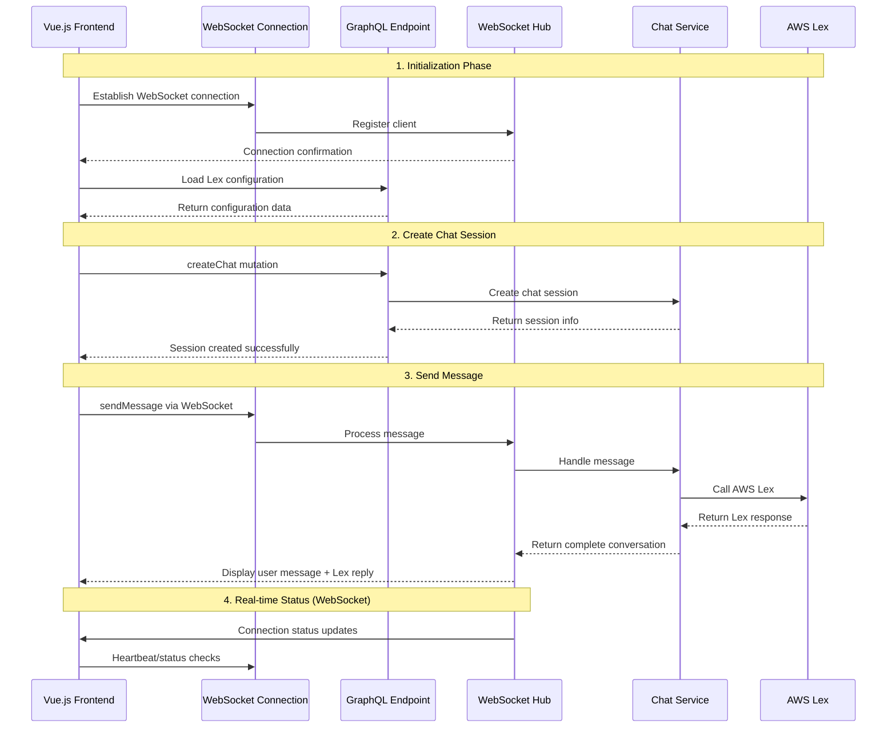

# WebSocket and Frontend Interaction Guide

## 🏗️ Current Architecture Analysis

### **Dual-Channel Communication Pattern**



## 🔌 **WebSocket Connection Mechanism**

### **Frontend Connection Establishment**
```javascript
// 1. Auto-connect on page load
async mounted() {
    this.connectWebSocket();  // Establish WebSocket connection
    await this.loadLexConfig(); // Load configuration
}

// 2. WebSocket connection handling
connectWebSocket() {
    const wsUrl = `ws://localhost:8080/ws`;
    this.ws = new WebSocket(wsUrl);
    
    // Connection established
    this.ws.onopen = () => {
        this.connected = true;
        console.log('WebSocket connected');
    };
    
    // Connection closed
    this.ws.onclose = () => {
        this.connected = false;
        console.log('WebSocket disconnected');
        // Auto-reconnect after 3 seconds
        setTimeout(() => {
            this.connectWebSocket();
        }, 3000);
    };
    
    // Receive messages
    this.ws.onmessage = (event) => {
        const message = JSON.parse(event.data);
        this.handleWebSocketMessage(message);
    };
}
```

### **Backend Hub Management**
```go
// 1. Hub structure - manages all WebSocket connections
type Hub struct {
    clients    map[*Client]bool  // Connected clients
    broadcast  chan []byte       // Broadcast message channel
    register   chan *Client      // Client registration channel
    unregister chan *Client      // Client unregistration channel
}

// 2. Connection upgrade handling
func (h *Hub) ServeWS(w http.ResponseWriter, r *http.Request) {
    // Upgrade HTTP to WebSocket
    conn, err := upgrader.Upgrade(w, r, nil)
    
    // Create client object
    client := &Client{
        ID:   generateClientID(),
        hub:  h,
        conn: conn,
        send: make(chan []byte, 256),
    }
    
    // Register client
    client.hub.register <- client
    
    // Start read/write goroutines
    go client.writePump()  // Send messages to client
    go client.readPump()   // Receive client messages
}

// 3. Hub run loop
func (h *Hub) Run() {
    for {
        select {
        case client := <-h.register:
            h.clients[client] = true
            log.Printf("Client connected: %s", client.ID)
            
        case client := <-h.unregister:
            delete(h.clients, client)
            close(client.send)
            log.Printf("Client disconnected: %s", client.ID)
            
        case message := <-h.broadcast:
            // Broadcast message to all clients
            for client := range h.clients {
                select {
                case client.send <- message:
                default:
                    close(client.send)
                    delete(h.clients, client)
                }
            }
        }
    }
}
```

## 📨 **Message Flow Mechanism**

### **Current Implementation (WebSocket-driven)**

```javascript
// Frontend message sending
sendMessage() {
    // 1. Immediately display user message
    const userMessage = {
        id: Date.now(),
        content: this.newMessage,
        isUser: true,
        sentAt: new Date().toISOString()
    };
    this.messages.push(userMessage);
    
    // 2. Send via WebSocket to backend
    const wsMessage = {
        type: 'send_message',
        chatId: this.currentChatId,
        content: messageText,
        messageId: messageId
    };
    
    this.ws.send(JSON.stringify(wsMessage));
    
    // 3. Lex reply will be received via WebSocket handler
}
```

### **WebSocket Message Handling (Real-time Communication)**
```javascript
// Handle WebSocket messages
handleWebSocketMessage(message) {
    console.log('Received message:', message);
    
    switch (message.type) {
        case 'message_response':
            // Handle message response from WebSocket
            if (message.data) {
                this.messages.push(message.data);
                this.scrollToBottom();
            }
            this.loading = false;
            break;
            
        case 'error':
            console.error('WebSocket error:', message.error);
            alert('Error: ' + message.error);
            this.loading = false;
            break;
            
        case 'pong':
            console.log('Received pong');
            break;
    }
}
```

## 🚀 **未来扩展可能性**

### **完全WebSocket化的消息流**
```javascript
// 可能的增强实现
sendMessageViaWebSocket() {
    const message = {
        type: 'send_message',
        chatId: this.currentChatId,
        content: this.newMessage,
        timestamp: Date.now()
    };
    
    // 通过WebSocket发送
    this.ws.send(JSON.stringify(message));
}

// 后端相应处理
func (c *Client) readPump() {
    for {
        _, message, err := c.conn.ReadMessage()
        var msg Message
        json.Unmarshal(message, &msg)
        
        switch msg.Type {
        case "send_message":
            // 调用ChatService处理消息
            // 将Lex回复通过WebSocket发送回去
        }
    }
}
```

## 📊 **Performance Characteristics**

### **Current WebSocket Mode Advantages**
1. **Real-time**: Low-latency bidirectional communication
2. **Efficiency**: Reduced HTTP request overhead
3. **Push Capability**: Server can actively push messages
4. **Persistent Connection**: Single connection for multiple operations

### **Architecture Benefits**
1. **Unified Communication**: Both data and real-time updates via WebSocket
2. **Scalability**: Better resource utilization with persistent connections
3. **Responsiveness**: Immediate message delivery without polling

## 🔧 **Technical Details**

### **Connection Lifecycle**
```
1. Page Load → Establish WebSocket connection
2. Connection Success → Update UI status (show "Connected")
3. User Actions → Send messages via WebSocket
4. Connection Failure → Auto-reconnect mechanism
5. Page Close → Clean up connection resources
```

### **Error Handling**
```javascript
// WebSocket error recovery
this.ws.onerror = (error) => {
    console.error('WebSocket error:', error);
};

this.ws.onclose = () => {
    this.connected = false;
    // Auto-reconnect after 3 seconds
    setTimeout(() => {
        this.connectWebSocket();
    }, 3000);
};

// Handle server-side errors
handleWebSocketMessage(message) {
    if (message.type === 'error') {
        console.error('Server error:', message.error);
        alert('Error: ' + message.error);
        this.loading = false;
    }
}
```

## 💡 **Summary**

The current WebSocket implementation is primarily used for:
1. **Real-time Message Communication** - Direct message sending and receiving
2. **Connection State Management** - Display online/offline status
3. **Auto-reconnection** - Automatic recovery when network disconnects
4. **Scalable Foundation** - Prepared for future real-time feature expansion

Core message delivery now uses WebSocket, which provides:
- Real-time bidirectional communication
- Reduced latency and server overhead
- Unified connection for all chat operations
- Better user experience with immediate responses

This represents a complete transition to WebSocket-based messaging while maintaining GraphQL for configuration and session management. The architecture provides both current functionality stability and a solid foundation for future real-time feature extensions.